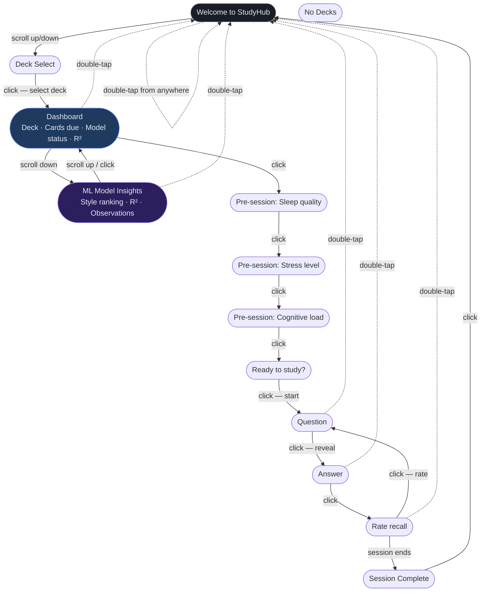

# Adaptive Learning — App Flow & Architecture

Paste the Mermaid blocks below into [mermaid.live](https://mermaid.live) to get an interactive,
editable diagram. Works on GitHub (renders automatically) and in VS Code with the Mermaid extension.

---

## Screen Navigation Flow

---

## BioLoop ML Data Flow

```mermaid
flowchart LR
    subgraph Input["Input — Per Card Review"]
        bio[Biometric Z-Scores\nsleep · stress · load]
        card[Card\ncomplexity · style]
        rating[User Rating\nagain/hard/good/easy]
        latency[Response Latency\nms]
    end

    subgraph Core["Core ML Pipeline"]
        obs[Observation\n75 features]
        prefs[Style Preferences\nonline bandit update]
        ols[OLS Regression\nridge λ=0.1 · 14-day decay]
        sched[SM-2+ Scheduler\ninterval × bio modifier]
    end

    subgraph Output["Output — Displayed to User"]
        dash[Dashboard Screen\nstatus · R² · best style]
        insights[ML Insights Screen\nfull style ranking]
        phone[Companion Phone App\nbar charts · deck list]
        next[Next card interval\n& presentation mode]
    end

    bio --> obs
    card --> obs
    rating --> obs
    latency --> obs
    obs --> prefs
    obs -->|every 5th obs ≥15 total| ols
    prefs --> next
    ols -->|status + R²| dash
    ols -->|style ranking| insights
    ols -->|style ranking| phone
    sched --> next
    bio --> sched

    style Core fill:#0f1117,stroke:#374151
    style Input fill:#0f1117,stroke:#374151
    style Output fill:#0f1117,stroke:#374151
```

---

## Button / Gesture Map per Screen

| Screen | Click | Scroll Up | Scroll Down | Double-tap |
|--------|-------|-----------|-------------|------------|
| welcome | Start planned study → bio_sleep | → deck_select | → deck_select | — |
| deck_select | Select highlighted deck → dashboard | Move selection up | Move selection down | → welcome |
| **dashboard** | → bio_sleep (checkin) | — | **→ model_insights** | → welcome |
| **model_insights** | → dashboard | → dashboard | — | → welcome |
| bio_sleep | → bio_stress | Decrease sleep rating | Increase sleep rating | → welcome |
| bio_stress | → bio_load | Decrease stress rating | Increase stress rating | → welcome |
| bio_load | → bio_confirm | Decrease load rating | Increase load rating | → welcome |
| bio_confirm | → start session | — | — | → welcome |
| question | Reveal answer → answer | — | — | → welcome |
| answer | → rating | — | — | → welcome |
| rating | Submit rating → next card | — | — | → welcome |
| summary | → welcome | — | — | → welcome |

> **Bold rows** = newly added in this update.

---

## File Architecture

```mermaid
graph TD
    main[src/main.ts] --> app[src/g2/app.ts\norchestrator]
    app --> conn[connection.ts\nSDK bridge + reconnect]
    app --> events[events.ts\ngesture dispatcher]
    app --> renderer[renderer.ts\nscreen builders]
    app --> state[state.ts\nglobal state]
    app --> session[core/session.ts\nsession manager]
    session --> scheduler[core/scheduler.ts\nSM-2+ + z-scores]
    session --> regression[core/regression.ts\nOLS + bandit]
    session --> storage[core/storage.ts\nlocalStorage]
    storage --> models[core/models.ts\ndata types]
    companion[companion/index.html\nphone app] -.->|reads localStorage| storage

    style companion fill:#2d1f5e,stroke:#a78bfa
    style regression fill:#1e3a5f,stroke:#6c8bef
    style scheduler fill:#1e3a5f,stroke:#6c8bef
```

